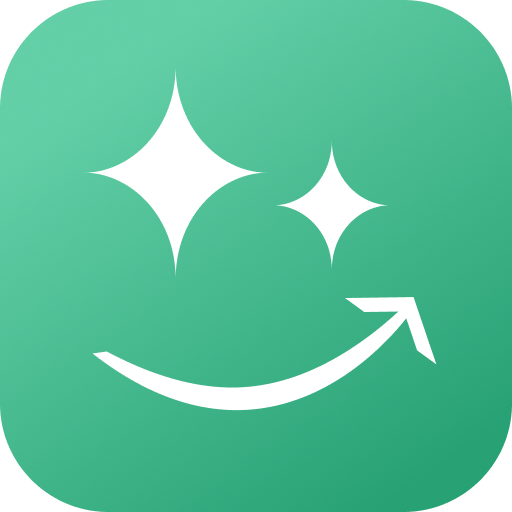

Hey

- Building now: [Pain Tracker](https://pain-tracker.app) (headache tracker with AI, solo product, 600+ weekly active users).
- Work: [Brevo Conversations](https://www.brevo.com/products/conversations) and [Chatra](https://chatra.com)
- Open-source projects: [Better Reviews for Amazon](https://github.com/vrizo/better-reviews-for-amazon) (userscript and browser extensions for clearer review signals on Amazon pages), [ChatGPT Bulk Exporter](https://github.com/vrizo/chatgpt-bulk-exporter) (userscript to export ChatGPT conversations in bulk), [Uibook](https://github.com/vrizo/uibook) (React component visual testing), [Ya Music Controls](https://github.com/vrizo/ya-music-controls) (web extension to control music player), [Whiteberries](https://github.com/vrizo/whiteberries) (dark marketing patterns blocker).
- Contact: [LinkedIn](https://www.linkedin.com/in/vitalii-rizo), [Email](mailto:vitalii.rizo@gmail.com).

 

  &nbsp;&nbsp;
  &nbsp;&nbsp;
  &nbsp;&nbsp;
  &nbsp;&nbsp;
  &nbsp;&nbsp;
  &nbsp;&nbsp;
  &nbsp;&nbsp;
  

